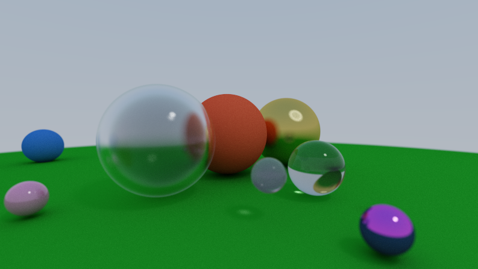

# Ray-tracer
## Description
Ray tracer on the GPU using OpenGL and some utility code from the course [TSBK03](https://computer-graphics.se/TSBK03/) by Ingemar Ragnemalm. This was based on [Ray Tracing in One Weekend](https://raytracing.github.io/books/RayTracingInOneWeekend.html) andthe [path tracing blog series](https://blog.demofox.org/2020/05/25/casual-shadertoy-path-tracing-1-basic-camera-diffuse-emissive/) by demofox. 

This took me about 3 days, almost half of the time spent on finding bugs such as division by zero and forgetting to upload data to the GPU. Future improvements include supporting triangle meshes and quads to be able to ray trace models and walls. Currently on spheres are supported. A relatively simple improvement would be to add keybindings for moving the camera.

Here is the resulting scene produced by the ray tracer after around 15 seconds on my laptop:

As can be seen in the picture, the ray tracer models
 - defocus blur (depth of field),
 - diffuse lighting,
 - specular lighting with surface roughness and
 - refraction with surface roughness and absorption.
This also produces some nice effects for free such as ambient occlusion and caustics. A bug I have not managed to solve yet is to make refractive spheres have a refraction colour. For some reason I get a bit of absorption but only a hint of colour.

## Building and running (Linux only)
### Dependencies 
OpenGL, cmake

### Build instructions
Simply run `make` in the root directory of the project.

### Running
Execute the binary `main`.

## Configuring the ray tracer
Camera position, the number of rays per pixel etc can be changed by changing the global variables at the top of `main.cpp`. This requires rebuilding the program. I felt too lazy to parse these parameters from file.
